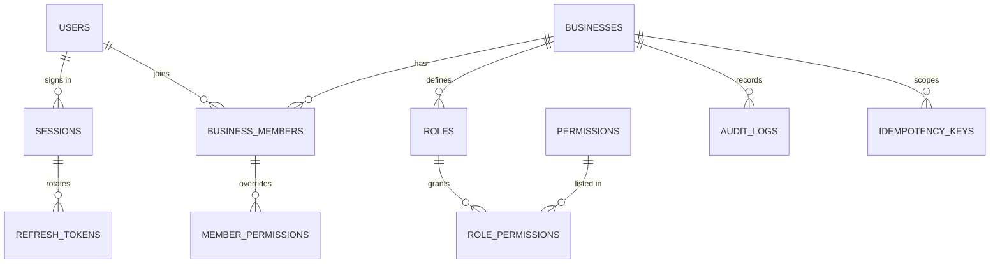

# Entity Relationship Model — Phase 1–4

**Status: finalised for Phase 1–4** (2026-08-30). Later phases extend it; the
authoritative version once code exists is the Drizzle schema in
`apps/api/src/db/schema/`. This file explains the *reasoning*, which the schema
cannot.

## Conventions on every tenant-owned table

| Column | Type | Why |
|---|---|---|
| `id` | `uuid` PK, default `gen_random_uuid()` | Non-enumerable; client-generatable offline |
| `business_id` | `uuid NOT NULL` | Tenancy. The RLS policy key. |
| `client_uuid` | `uuid` | Offline idempotency. `UNIQUE (business_id, client_uuid)` |
| `created_at` | `timestamptz NOT NULL DEFAULT now()` | |
| `updated_at` | `timestamptz NOT NULL DEFAULT now()` | Touched by trigger |
| `created_by` | `uuid REFERENCES users(id)` | Accountability |
| `updated_by` | `uuid REFERENCES users(id)` | |
| `deleted_at` | `timestamptz` | Soft delete. Every query filters it. |
| `version` | `integer NOT NULL DEFAULT 1` | Optimistic concurrency for sync |

**Indexes are compound**, `(business_id, <filtered column>)` — never the filtered
column alone. A single-column index on `status` is useless under RLS and misleads
the planner.

Money is `NUMERIC(14,2)`. Never `float`, never `money`, never an integer of paise
(see ADR 0005 — the decision is NUMERIC in the database, string on the wire).

## Non-tenant tables

`users` is deliberately **not** tenant-scoped — one human, one row, many
businesses. Same for `sessions`, `refresh_tokens`, `otp_requests`, and the
`permissions` catalogue.

### users
```
id uuid pk
phone            text NOT NULL UNIQUE     -- E.164, e.g. +919876543210
phone_verified_at timestamptz
name             text
avatar_key       text                     -- storage key, nullable
status           text NOT NULL DEFAULT 'active'   -- active | suspended
created_at, updated_at
```
Phone is the identity. There is no email and no password — see ADR 0007.

### otp_requests
```
id uuid pk
phone         text NOT NULL
code_hash     text NOT NULL          -- argon2id. NEVER the plaintext code.
expires_at    timestamptz NOT NULL
attempts      int NOT NULL DEFAULT 0
consumed_at   timestamptz
ip            inet
created_at
```
Index `(phone, created_at DESC)` drives the per-number rate limit. A background
job prunes rows older than 24h.

### sessions / refresh_tokens
```
sessions        id, user_id, device_name, platform, app_version,
                last_seen_at, revoked_at, created_at
refresh_tokens  id, session_id, token_hash, family_id, parent_id,
                expires_at, used_at, revoked_at, created_at
```
`family_id` + `parent_id` implement **reuse detection**: presenting an already-used
refresh token revokes the entire family. This is the single most valuable thing in
the auth design and costs two columns.

## Tenancy

### businesses
```
id uuid pk
name             text NOT NULL
vertical         text NOT NULL      -- furniture | fabrication | general
currency         char(3) NOT NULL DEFAULT 'INR'
timezone         text NOT NULL DEFAULT 'Asia/Kolkata'
join_code        text NOT NULL UNIQUE
join_code_rotated_at timestamptz
requires_approval boolean NOT NULL DEFAULT false
modules_enabled  jsonb NOT NULL DEFAULT '{}'
label_overrides  jsonb NOT NULL DEFAULT '{}'
logo_key         text
created_by, created_at, updated_at, deleted_at
```
`vertical` is read **once**, at creation, to run the seed pack. It is never
consulted at runtime — see ADR 0004.

### business_members
```
id uuid pk
business_id, user_id           UNIQUE (business_id, user_id)
role_id        uuid NOT NULL
status         text NOT NULL DEFAULT 'active'   -- pending | active | revoked
invited_by, joined_at, revoked_at
```
Revocation is a status change plus session revocation, never a delete — the audit
trail must survive.

### roles / permissions / role_permissions / member_permissions
```
permissions        key text pk, description        -- global catalogue, seeded
roles              id, business_id, key, name, is_system
role_permissions   role_id, permission_key         -- default grant
member_permissions member_id, permission_key, granted boolean
```
`member_permissions.granted` is a tri-state override: absent = inherit from role,
true = grant, false = revoke. This is what makes the BRD's nine "Configurable"
cells expressible without a code branch.

## Audit

### audit_logs — append-only
```
id uuid pk
business_id  uuid            -- null for global events (login, user creation)
actor_id     uuid
action       text NOT NULL   -- e.g. 'payment.record', 'member.role_change'
entity_type  text NOT NULL
entity_id    uuid
before       jsonb
after        jsonb
request_id   text
ip           inet
app_version  text
created_at   timestamptz NOT NULL DEFAULT now()
```
No `updated_at`, no `deleted_at` — the row never changes. The application role is
granted `INSERT` and `SELECT` only; `UPDATE` and `DELETE` are not granted at all.
Written **inside the same transaction** as the change it describes.

## Idempotency

### idempotency_keys
```
key           text NOT NULL          -- the Idempotency-Key header
business_id   uuid
user_id       uuid
endpoint      text NOT NULL
request_hash  text NOT NULL          -- guards against key reuse with a different body
status        text NOT NULL          -- in_progress | completed
response_code int
response_body jsonb
created_at, completed_at
PRIMARY KEY (business_id, key)
```
Retained 30 days. A repeat with the same key **replays the stored response**. A
repeat with the same key but a *different* `request_hash` is a client bug and
returns 422 rather than silently doing something unexpected.

## Row-level security

Every tenant table:

```sql
ALTER TABLE <t> ENABLE ROW LEVEL SECURITY;
ALTER TABLE <t> FORCE  ROW LEVEL SECURITY;   -- owner is not exempt

CREATE POLICY tenant_isolation ON <t>
  USING      (business_id = current_setting('app.business_id', true)::uuid)
  WITH CHECK (business_id = current_setting('app.business_id', true)::uuid);
```

`WITH CHECK` matters as much as `USING` — without it a caller could *insert* a row
belonging to another tenant even though they could not read it back.

Every request runs inside `withTenant(businessId, fn)`, which opens a transaction
and issues `SET LOCAL app.business_id`. `SET LOCAL` is transaction-scoped, so a
pooled connection cannot leak the setting into the next request.

The application's database role must not be `SUPERUSER` and must not have
`BYPASSRLS`. Verified by a test, because it is silently catastrophic.

## Diagram — Phase 1 scope



## Deferred to later phases

Configuration tables (`field_definitions`, `order_statuses`, taxonomies) land in
Phase 2. Orders, money, labour, stock, machinery and attachments follow in their
own phases. They all inherit the conventions above — that is the point of fixing
them now.

## Open questions

- **Phone number changes.** A worker changing their number is common. Deferred to
  Phase 5, but `users.phone` being `UNIQUE` means the migration path needs
  thinking about before then, not after.
- **Hard-delete policy.** Soft delete everywhere for now. A real deletion route is
  needed for Play Store compliance (Phase 11) and must decide what happens to
  audit rows that reference the deleted user.
